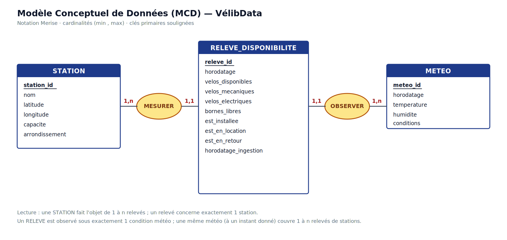
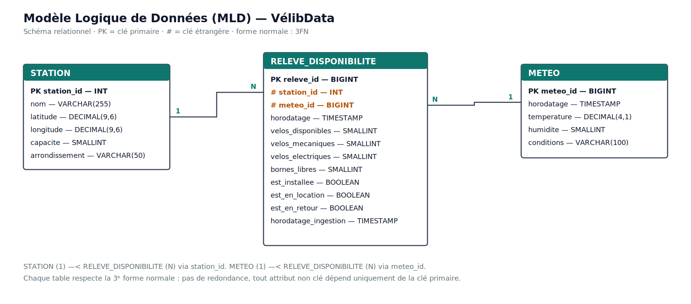

# Modélisation normalisée des données — MCD / MLD

**Projet VélibData — Plateforme Big Data**
**MSPR RNCP36921 — Blocs 2 & 4**
**Équipe :** Ilias Errazi (Data Engineer / chef de projet) · Manal Jawhar (Data Analyst / sécurité-DLP) · Issmail Khouyi (Data Science / veille / Green IT)
**Version :** 1.0 — 29 juin 2026

---

## 1. Objet et positionnement du livrable

Le cahier des charges demande explicitement, à deux reprises, de *« proposer une modélisation normalisée des données qui facilite l'intégration et l'analyse des informations recueillies »* et d'*« établir une base de données normalisée capable de gérer des volumes croissants de données et d'assurer une requête efficace »*.

Ce document répond à cette exigence en présentant le **Modèle Conceptuel de Données (MCD)** puis le **Modèle Logique de Données (MLD)** de la plateforme, la démarche de normalisation (jusqu'à la 3ᵉ forme normale), et enfin l'articulation entre ce modèle normalisé et la table dénormalisée `stations_enrichies` réellement servie à Power BI.

### 1.1 Modèle normalisé et couche de service : deux vues complémentaires

Un point mérite d'être clarifié d'emblée, car il structure toute l'architecture de données :

- Le **modèle normalisé** (ce document) est la **référence conceptuelle et logique** : il décrit *comment les données se structurent et se relient*, sans redondance. C'est le modèle qu'on utiliserait pour une base transactionnelle et qui garantit l'intégrité.
- La table **`stations_enrichies` de la zone CURATED** est une **couche de service dénormalisée** (aplatie), délibérément optimisée pour la lecture analytique par Power BI (moins de jointures, meilleures performances de dashboard).

Cette dualité est une pratique standard en Big Data : on modélise proprement en normalisé, et on **dénormalise à dessein** au dernier maillon pour la performance analytique. La dénormalisation de CURATED n'est donc pas une entorse au modèle, mais son projection optimisée pour l'usage décisionnel (§5).

---

## 2. Modèle Conceptuel de Données (MCD)

Le MCD, en notation Merise, identifie les entités du domaine métier VélibData et leurs associations, indépendamment de toute technologie.

### 2.1 Entités

| Entité | Rôle | Source |
|---|---|---|
| **STATION** | Référentiel statique des stations Vélib' (identité, localisation, capacité) | API Vélib' `station_information` |
| **RELEVE_DISPONIBILITE** | Série temporelle : état d'une station à un instant donné | API Vélib' `station_status` |
| **METEO** | Conditions météo à un instant donné (facteur explicatif de la demande) | API OpenWeatherMap |

### 2.2 Associations et cardinalités

- **STATION (1,n) — MESURER — (1,1) RELEVE_DISPONIBILITE**
  Une station fait l'objet de 1 à n relevés au fil du temps ; un relevé concerne exactement une station.
- **RELEVE_DISPONIBILITE (1,1) — OBSERVER — (1,n) METEO**
  Un relevé est associé aux conditions météo d'un instant ; une même observation météo (à un horodatage donné) couvre les relevés de toutes les stations à cet instant.

Ces cardinalités traduisent la réalité métier : la disponibilité est un flux temporel rattaché à un référentiel stable (les stations) et contextualisé par la météo.

---

## 3. Modèle Logique de Données (MLD)

Le passage MCD → MLD applique les règles de traduction relationnelle : chaque entité devient une table, chaque association 1,n place la clé primaire du côté « 1 » comme clé étrangère du côté « n ».

Schéma relationnel obtenu (clé primaire **soulignée**, clé étrangère préfixée par `#`) :

- **STATION** (<u>station_id</u>, nom, latitude, longitude, capacite, arrondissement)
- **METEO** (<u>meteo_id</u>, horodatage, temperature, humidite, conditions)
- **RELEVE_DISPONIBILITE** (<u>releve_id</u>, #station_id, #meteo_id, horodatage, velos_disponibles, velos_mecaniques, velos_electriques, bornes_libres, est_installee, est_en_location, est_en_retour, horodatage_ingestion)

### 3.1 Dictionnaire des types et contraintes

| Table | Colonne | Type | Contrainte |
|---|---|---|---|
| STATION | station_id | INT | PK, NOT NULL |
| STATION | nom | VARCHAR(255) | NOT NULL |
| STATION | latitude / longitude | DECIMAL(9,6) | NOT NULL (WGS84) |
| STATION | capacite | SMALLINT | NOT NULL, ≥ 0 |
| STATION | arrondissement | VARCHAR(50) | nullable (enrichi) |
| METEO | meteo_id | BIGINT | PK, NOT NULL |
| METEO | horodatage | TIMESTAMP | NOT NULL |
| METEO | temperature | DECIMAL(4,1) | — |
| METEO | humidite | SMALLINT | 0–100 |
| METEO | conditions | VARCHAR(100) | — |
| RELEVE | releve_id | BIGINT | PK, NOT NULL |
| RELEVE | station_id | INT | FK → STATION, NOT NULL |
| RELEVE | meteo_id | BIGINT | FK → METEO |
| RELEVE | horodatage | TIMESTAMP | NOT NULL, indexé |
| RELEVE | velos_disponibles / _mecaniques / _electriques | SMALLINT | ≥ 0 |
| RELEVE | bornes_libres | SMALLINT | ≥ 0 |
| RELEVE | est_installee / est_en_location / est_en_retour | BOOLEAN | NOT NULL |
| RELEVE | horodatage_ingestion | TIMESTAMP | NOT NULL |

---

## 4. Démarche de normalisation (1FN → 3FN)

Le modèle a été normalisé jusqu'à la **3ᵉ forme normale** afin d'éliminer les redondances et les anomalies de mise à jour :

- **1ᵉ forme normale (1FN)** — tous les attributs sont atomiques. Les vélos mécaniques et électriques sont deux colonnes distinctes plutôt qu'une liste ; chaque relevé est une ligne unique.
- **2ᵉ forme normale (2FN)** — le modèle est en 1FN et tout attribut non clé dépend de **l'intégralité** de la clé primaire. Les clés étant atomiques (`station_id`, `releve_id`, `meteo_id`), il n'existe pas de dépendance partielle.
- **3ᵉ forme normale (3FN)** — aucun attribut non clé ne dépend d'un autre attribut non clé. Les attributs descriptifs de la station (nom, capacité, coordonnées) sont isolés dans STATION et ne sont **pas répétés** à chaque relevé ; les attributs météo sont isolés dans METEO. Un relevé ne stocke que des références (`station_id`, `meteo_id`) et ses propres mesures.

**Bénéfice concret :** sans normalisation, chacun des ~360 millions de relevés annuels dupliquerait le nom, la capacité et les coordonnées de sa station, ainsi que la météo. La normalisation supprime cette redondance massive, garantit qu'une correction sur une station se fait en un seul endroit, et assure des requêtes cohérentes — ce qui répond directement à l'exigence de *« gérer des volumes croissants et assurer une requête efficace »*.

---

## 5. Du modèle normalisé à la zone CURATED (dénormalisation maîtrisée)

La zone analytique CURATED matérialise une **projection dénormalisée** du modèle : la table `stations_enrichies` pré-joint STATION, RELEVE_DISPONIBILITE et METEO, et pré-calcule des indicateurs (ex. `taux_occupation`).

| Modèle normalisé (référence) | Zone CURATED (service) |
|---|---|
| 3 tables reliées par clés étrangères | 1 table aplatie `stations_enrichies` |
| Optimisé pour l'intégrité et l'écriture | Optimisé pour la lecture / le dashboard |
| Pas de redondance | Redondance assumée (données de station répétées par ligne) |
| Requêtes avec jointures | Requêtes sans jointure (performance Power BI) |

Ce choix relève du patron **schéma en étoile** de l'informatique décisionnelle : STATION et METEO jouent le rôle de dimensions, RELEVE_DISPONIBILITE celui de table de faits, et CURATED en est la vue matérialisée. La traçabilité entre les deux est assurée dans OpenMetadata (data lineage, cf. Bloc 1).

---

## 6. Conclusion

La plateforme VélibData dispose d'un modèle de données **normalisé en 3FN** (MCD + MLD), qui garantit l'intégrité, l'absence de redondance et l'efficacité des requêtes à volume croissant, conformément au cahier des charges. Ce modèle de référence est **délibérément projeté** en une couche CURATED dénormalisée pour servir efficacement les tableaux de bord métier. Les deux vues sont cohérentes et tracées : la première assure la rigueur, la seconde la performance analytique.

---

*Réutilise et formalise la modélisation esquissée au Bloc 1 (§7 du rapport stratégie). Diagrammes sources : `Bloc4_MCD_VelibData.svg` et `Bloc4_MLD_VelibData.svg`. À versionner dans `docs/`.*
