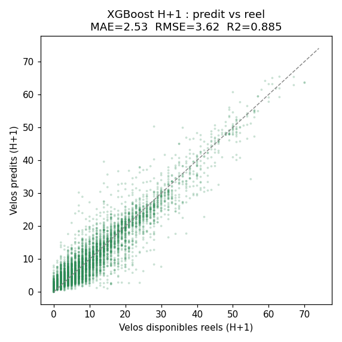
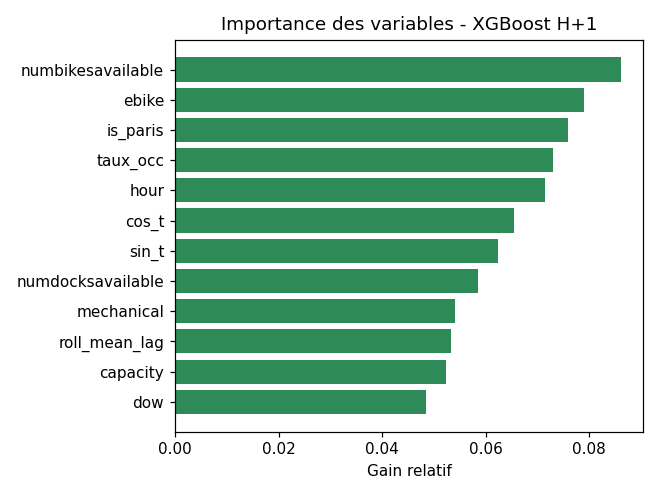
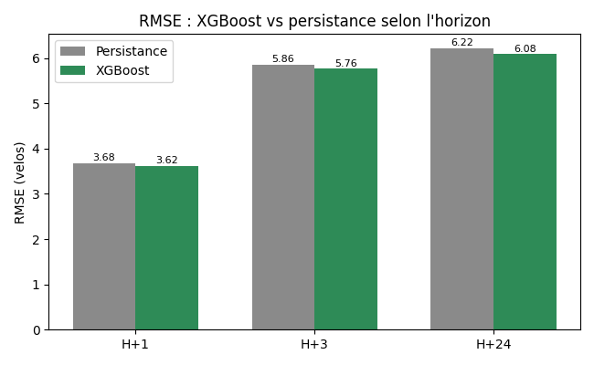
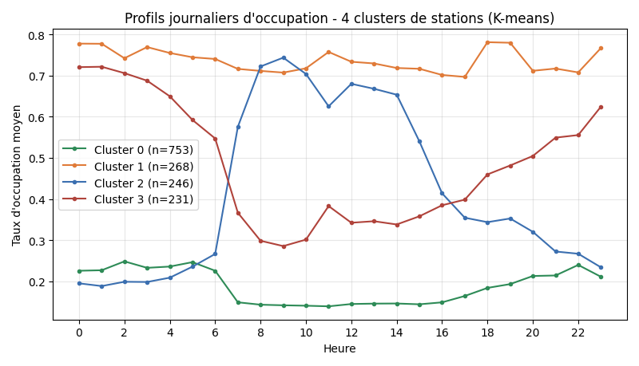

# POC Machine Learning — Prévision de disponibilité Vélib' à H+1 / H+3 / H+24

**Bloc 1 — Roadmap Phase 3 « Analyse & ML »**
Rôle : Data Scientist (Issmail) — Projet VélibData

---

## 1. Objectif et positionnement

Le rapport Bloc 1 prévoyait, en Phase 3 de la roadmap, une couche analytique prédictive
visant à **anticiper la disponibilité des vélos par station** afin d'aider au rééquilibrage
et d'informer l'usager. Ce document présente le **proof of concept** correspondant :
un modèle de prévision du nombre de vélos disponibles à horizon **1 heure (H+1)**,
**3 heures (H+3)** et **24 heures (H+24)** — les trois horizons annoncés au Bloc 1 —
entraîné sur l'historique réel de la plateforme.

Ce POC relève du **Bloc 1** (stratégie data et exploitation analytique) et non du Bloc 4
(administration de l'infrastructure). Il exploite la donnée *produite* par la plateforme,
sans en modifier le périmètre d'administration.

## 2. Source des données

Point d'architecture important : la zone **CURATED** est un *snapshot* écrasé toutes les
120 secondes (`mode overwrite`) — elle ne contient donc **aucun historique**. La série
temporelle nécessaire à l'apprentissage provient de la zone **CLEAN**
(`clean/station_status`), alimentée en *append* par le job Spark de nettoyage.

L'historique a été extrait de MinIO, puis agrégé par **créneaux de 15 minutes** et par
station (moyenne intra-créneau). Caractéristiques du jeu obtenu :

| Élément | Valeur |
|---|---|
| Période couverte | 23 juin → 3 juillet 2026 (~10,4 jours) |
| Stations | 1 518 |
| Lignes (créneaux 15 min agrégés) | 170 053 |
| Colonnes | vélos dispo, docks dispo, mécaniques, électriques, capacité, commune |

**Honnêteté sur la donnée :** l'historique est **fragmenté**. Le pipeline ayant été
arrêté/redémarré plusieurs fois (incidents documentés au Bloc 4 : `docker compose down`,
purge de checkpoints), seuls ~59 % des relevés consécutifs sont réellement espacés de
15 minutes, et deux journées (28 juin, 1er juillet) sont manquantes. Après reconstruction,
**63 928 créneaux disposent d'une cible H+1 réelle** (non interpolée) — volume suffisant
pour un POC, insuffisant pour capter une saisonnalité hebdomadaire complète.

## 3. Méthodologie

**Feature engineering** (à partir des seules valeurs réelles, sans interpolation) :
- état courant : vélos disponibles, docks, mécaniques, électriques, capacité, taux d'occupation ;
- **lags** : vélos disponibles à t−15, t−30, t−45, t−60 min (valeurs manquantes gérées
  nativement par XGBoost, sans imputation artificielle) ;
- **variables temporelles** : heure, jour de la semaine, indicateur week-end, encodage
  cyclique (sin/cos) de l'heure ;
- variable géographique : appartenance à Paris intra-muros.

**Cible.** Le modèle prédit la **variation** (delta) du nombre de vélos entre *t* et
*t+horizon*, la prévision absolue étant reconstruite par `valeur_courante + delta`. Ce
choix force le modèle à apprendre la *dynamique* plutôt qu'à recopier l'état courant.

**Découpage temporel strict** (anti-fuite) : entraînement sur les premiers jours, test sur
les **2 derniers jours**. Aucun mélange aléatoire — on n'utilise jamais le futur pour
prédire le passé.

**Modèle.** `XGBoost` (gradient boosting), 400 arbres, profondeur 6, learning rate 0,05.

**Référence (baseline).** Modèle **« persistance »** : prédire que la disponibilité dans
1 h sera égale à la disponibilité actuelle. C'est la référence honnête à battre — la
mentionner et la comparer est un marqueur de rigueur méthodologique.

## 4. Résultats

| Horizon | Modèle | MAE (vélos) | RMSE (vélos) | R² | Gain RMSE vs baseline |
|---|---|---:|---:|---:|---:|
| **H+1** | Persistance | 2,50 | 3,68 | — | |
| **H+1** | **XGBoost** | 2,53 | **3,62** | **0,885** | −1,6 % |
| **H+3** | Persistance | 4,01 | 5,86 | — | |
| **H+3** | **XGBoost** | **3,99** | **5,76** | **0,717** | −1,7 % |
| **H+24** | Persistance | 4,23 | 6,22 | — | |
| **H+24** | **XGBoost** | **4,21** | **6,08** | **0,691** | −2,3 % |

*(MAE = erreur absolue moyenne, en nombre de vélos ; test sur les 2 derniers jours,
21 993 créneaux à H+1, 6 025 à H+3, 6 747 à H+24.)*







**Lecture des résultats — analyse honnête :**

1. **À H+1, la persistance est une référence très forte.** En 1 heure, le nombre de vélos
   d'une station bouge peu : connaître la valeur actuelle suffit déjà à prédire correctement
   (R² = 0,88). XGBoost fait **jeu égal** (RMSE légèrement meilleure, −1,6 %). Ce n'est pas
   une faiblesse du modèle mais une **propriété du problème** à cet horizon.

2. **La valeur du ML croît avec l'horizon.** Le gain de XGBoost sur la persistance passe de
   **−1,6 % (H+1)** à **−1,7 % (H+3)** puis **−2,3 % (H+24)** : plus on prévoit loin, plus
   le modèle apporte. À noter aussi que la persistance à H+24 (RMSE 6,22) ne se dégrade que
   modérément par rapport à H+3 (5,86) — logique, car à 24 h on retombe sur le **même moment
   de la journée**, période où l'occupation est relativement prévisible par simple
   périodicité quotidienne.

3. **Variables déterminantes** (cf. importance) : la valeur courante domine (~68 %), suivie
   du nombre de vélos mécaniques et du taux d'occupation. Les variables calendaires
   (heure, jour) ont une importance faible — attendu à si court horizon, **et** amplifié par
   le faible volume : avec seulement ~10 jours fragmentés, les motifs horaires/hebdomadaires
   ne sont pas assez répétés pour être appris.

4. **Facteur limitant = volume de données, pas la méthode.** En production, l'entraînement
   sur la **rétention 30 jours** (RAW/CLEAN) capterait les cycles matin/soir et
   semaine/week-end, ce qui creuserait l'avantage du ML sur la persistance, en particulier
   aux heures de pointe.

## 5. Analyse complémentaire — Clustering des stations (K-means)

Au-delà de la prévision, un **clustering non supervisé** (K-means, k=4) sur le **profil
journalier d'occupation** de chaque station révèle quatre comportements types :



| Cluster | Stations | Nuit | Matin (7-9h) | Soir (17-19h) | Interprétation |
|---|---:|---:|---:|---:|---|
| 0 | 753 | 0,24 | 0,14 | 0,18 | Stations **chroniquement vides** |
| 1 | 268 | 0,76 | 0,71 | 0,75 | Stations **chroniquement pleines** |
| 2 | 246 | 0,21 | **0,70** | 0,35 | Zones de **destination** (se remplissent le matin) |
| 3 | 231 | 0,65 | **0,31** | 0,45 | Zones de **départ / résidentielles** (se vident le matin) |

Les clusters 2 et 3 sont l'image miroir l'un de l'autre et capturent la **dynamique
pendulaire** parisienne : le matin, les vélos quittent les zones résidentielles (cluster 3)
pour s'accumuler dans les zones d'emploi (cluster 2). Ce résultat, directement exploitable
pour cibler le **rééquilibrage**, illustre la valeur métier de la couche analytique.

## 6. Limites et perspectives

- **Volume et continuité** : reconstruire un historique continu de plusieurs semaines
  (rétention 30 j) est le levier n°1 pour améliorer les performances.
- **LSTM** (cité au Bloc 1) : pertinent une fois disposé de séquences continues et longues ;
  sur l'historique fragmenté actuel, un modèle séquentiel serait pénalisé — XGBoost, robuste
  aux trous, est le bon choix pour ce POC.
- **H+24** : traité dans ce POC, mais un historique de plusieurs semaines affinerait nettement
  la prévision à cet horizon (apprentissage du cycle quotidien complet et de l'effet jour de semaine).
- **Détection d'anomalies** : le clustering fournit une base (station qui s'écarte durablement
  de son profil = anomalie candidate).
- **Industrialisation** : le script est réexécutable et pourrait être planifié (job Spark ou
  conteneur Python) pour un ré-entraînement périodique, la prévision alimentant ensuite un
  visuel Power BI ou une alerte de rééquilibrage.

## 7. Reproductibilité

```bash
# 1. Export de l'historique CLEAN vers un CSV agrégé 15 min (voir export)
# 2. Dépendances
pip install pandas pyarrow xgboost scikit-learn matplotlib
# 3. Exécution
python poc_ml_velib.py        # prévision H+1/H+3 + graphes
python cluster.py             # clustering des stations
```

Entrée : `velib_ml.csv`. Sorties : métriques (`metrics.json`), figures (`g1..g5.png`),
affectation des clusters (`station_clusters.csv`).
